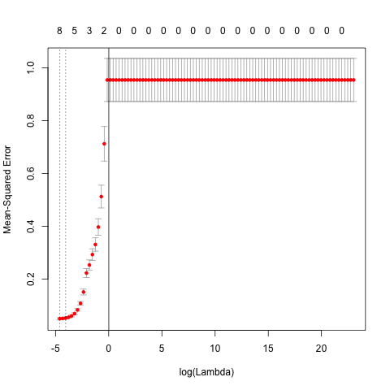

```{r setup, include=FALSE}
knitr::opts_chunk$set(echo = TRUE)
```

# Abstract
Incorporating all the resources learned in Stat 159, we will dive deeper into data analytics by applying more advanced statistical learning methods to model a data set listing credit information of 400 randomly selected individuals. This project will reproduce the methods performed in Chapter 5 and 6 from the textbook, *An Introduction to Statistical Learning” by James et al*. These sections cover cross-validation techniques and linear model selection/regularization methods, both of which are necessary in locating the optimal model for a given data set. The credit data set is sourced from the following url: `http://www-bcf.usc.edu/~gareth/ISL/Credit.csv`. Collaborating with a partner was mandatory, which allowed us to become more comfortable with Github and Git processes.


# Introduction

The motivation for this project is to perform a predictive modeling process to the Credit data set. The first step in data analysis is to understand and search for key characteristics in the working data set. Gaining insight into the relationships among the multiple variables is essential in subset selection and prior knowledge into locating which variables are insignificant. After completing the section covering exploratory data analysis, the Credit data set will be processed to be prepared for model fitting, which includes centering/standardizing each variable column and dealing with categorical variables. The processed Credit data set is then split into training and test sets and thereafter, five different regression models are fitted to select the best model in accurately predicting the response variable Balance.


# Data


The Credit data set presents information on 11 different characteristics of 400 bank accounts. Of these 11 variables, 7 of them are quantitative and the remaining 4 are qualitative. Below contains a brief description of each variable.

**Quantitative**

* `Income`: customer's income
* `Limit`: customer's credit limit
* `Rating`: customer's credit rating
* `Cards`: number of credit cards
* `Age`: customer's age
* `Education`: number of years in education
* `Balance`: current balance in the customer's bank

**Qualitative**

* `Gender`: customer's gender (factor with two levels - Male/Female)
* `Student`: customer's current student status (factor with 2 levels - Yes/No)
* `Married`: customer's current marital status (factor with 2 levels - Yes/No)
* `Ethnicity`: customer's ethnicity (factor with 3 levels - Asian/Caucasian/AfricanAmerican)

For this project, we will see which model we fit will most closely predict with the quantitative variable `Balance`. Thus, we can consider the Balance variable as a response and the other variables as predictors. Since there are 11 variables and 400 customers, the Credit data set has a 400 x 11 dimension. In the next section, in order to assess the accuracy of each regression fit, the Credit data set must be split into two, a training set and a test set.


# Methods

## Exploratory Data Analysis
Descriptive statistics of `Credit` were explored by displaying their summary statistics. All quantitative variables in `Credit` were plotted with the following: histograms, boxplots, and frequency tables. All qualitative variables in `Credit` were visually displayed by conditional boxplots. With both quantitative and qualitative variables, a scatterplot matrix, matrix of correlations, and anova outputs were produced. All of these images and descriptions are stored in the data directory of this project.

## Training and Test Sets
To split the Credit data set, the `test_split_script.R` was used. In the source code, 300 rows were randomly selected and stored into a csv file called `train_credit.csv`. The remaining 100 rows were written into a csv file called `test_credit.csv`.  The regression models will be trained onto the 300-row data set and their fitted predictions will be measured by how much they deviate from the test set predictions.

## Pre-modeling Data Processing
Since the splitted data sets were still raw, pre-processing techniques were done to properly prepare for modeling. The four categorical variables cannot be interpreted by the model functions in R, so it is better to convert them to numerical values.  The categorical variables with 2 levels can be converted to a dummy variable while the variable with 3 levels such as Ethnicity needs two binary columns or two dummy variables. The function `model.matrix()` does this automatically, converting the data set into a 400 x 12 data frame. 

In addition, the coefficients after fitting each model may be unexpectedly altered by the scaling of each variable. Thus, it is proper to standardize and center each column so that comparisons among each variable are done fairly and that the beta coefficients do not blow up.

## Regression Models

The following lists the 5 regressions that will be applied to the `Credit` data set:

* Ordinary Least Squares Regression
* Ridge Regression
* Lasso Regression
* Principal Components Regression
* Partial Least Squares Regression

We start with the ordinary least squares regression model to fit onto the Credit data set. After computing the test mean standard error, this statistic will serve as a basis to compare the accuracies of the other models. The OLS regression will be performed by the `ols_script.R`, using the `lm()` function to model Balance over the 11 predictors (with the 2 dummy variables). From this model object, we then use the `predict()` function on the test predictors and calculate its mean squared error by comparing the test's values of `Balance`

Another set of more complex models considers shrinkage methods. These models, ridge regression and lasso regression, shrink the coeffcients to 0 by setting a constraint to the beta coefficients, having lambda as the tuning parameter. The difference in ridge and lasso is the formula inside of the sum of the constraint. The following provides a step-by-step instruction on how these methods work:

* Load the library called `glmnet` and read in the training and test sets.
* Split the the training set by subsetting every column except Balance into x and Balance into y.
* Perform the regression using the function `cv.glmnet()`. A 10-fold cross validation technique is applied by setting `nfold = 10`. Since we already standardized and centered the variables, the argument `intercept` and `standardize` are set to `FALSE`. By default, `cv.glmnet()` incorporates all lambdas, but in this project, we will assume that `lambda = 10^seq(10, -2, length = 100)`. The alpha argument differentiates between the two models: ridge regression is performed when alpha = 0 and lasso regression is performed when alpha = 1.
* The model object after fitting one of these shrinkage regression models displays a unique model for each lambda gived from `grid`. We use this object and retrieve the lowest lambda by `model_object$min.lambda`. 
* A plot of the cross-validation errors can be done easily by using the `plot()` function. The lowest lambda is saved onto the text file and the plot is saved as a png image. 
* Use the model object and the `predict()` function to make predictions on the predictor variables of the test set. The mean squared error is then calculated by comparing the predictions and the actual response values. The MSE is stored into the text file as well.
* Using the lowest lambda, the optimal model is refitted onto the whole data set `scaled_credit.csv` and the model's coefficients are then saved into the same text file.

The last two regression models deal with dimension reduction by locating which predictors explain the most variance of Balance. Knowing how many predictors or components to use depends on which set of components has the lowest MSE. Principal Components Regression and Partial Least Squares Regression are run by the `pcr_script.R` and `plsr_script.R`.

* Load the library called `pls` and read in the training and test sets.
* Use the model fitting functions `pcr()` and `plsr()` to run the regressions, setting `formula = Balance ~.` and  `validation = 'CV'`. The data should only cover the training set.
* The best model in the cross-validations is found using `which.min(model_object$validation$PRESS)`. This value is stored into a text file.
* Plot the model using the `plot()` function and save it as a png image.
* Use the test set to predict the response Balance and compare it to the real Balance observations, thereafter calculating the test mean squared error of the model. The MSE is stored in a text file.
* Fit the model onto the `scaled_credit.csv` with `ncomp` equal to the minimum principal components found before in cross-validation since this model will lead to the lowest MSE. The coefficients of this official model is then saved into a text file.

These five regression methods are then compared by their MSEs, and the model with the lowest MSE is considered the best. Other model statistics can be used for comparisons, but for this project, the MSE is the most convenient.


# Analysis

```{r,echo=FALSE}
library(xtable)
options(xtable.comment = FALSE)
options(knitr.comment = FALSE)
load('../data/ols_model.RData')
load('../data/ridge_models.RData')
load('../data/lasso_models.RData')
load('../data/pcr_models.RData')
load('../data/plsr_models.RData')
load('../data/correlation_matrix.RData')
source('../code/functions/functions.R')
```

## Ordinary Least Squares

The first method we consider is fitting an OLS Regression onto the dat set. We output the test MSE for the method and its table of coefficients. The test MSE is shown below. 

```{r}
print(ols_mse)
```

The table below displays the coefficients for the ols model. 

```{r, echo = FALSE, results = 'asis', message = FALSE}
library(xtable)
ols_coef <- data.frame('Coefficients' = names(ols$coefficients),
                       'Values' = unname(ols$coefficients))
ols_coefficents = xtable(ols_coef, caption = 'Table of coefficients of each predictor when regressed against Balance',type = "Latex")
print(ols_coefficents)
```

We notice that the coefficients are negative on predictor variables such as `Income`, `Age`, `Education` , `Female` and `Married`. The implication is that these predictors have negative relationships with `Balance`, indicating that an increase in any of these variables results in a decrease in `Balance`

## Lasso Regression
Lasso regression is performed at this stage. Training data and testing data help us fit the model that determine the lambda value that minimizes the mean-squared error. From this cross-validation, we found the optimal lambda value by locating the minimum of the plot below.

```{r, out.width = "200px", echo=FALSE, fig.align="center"}

```

The MSE, official coefficients, and best lambda for the lasso regression are shown below.
```{r, echo = FALSE, message = FALSE}
paste('Lasso MSE:', lasso_mse)
paste('Lasso Lambda:', best_lambda)
```

This model is is then run to produce mean-squared errors. We can then predict values for variable `Balance` within some particular range. Finally, we ran the model on our full dataset to produce the model's coefficients.

## Ridge Regression
Ridge Regression is also performed. The methods used are similar to the ones in Lasso Regression. First we fit the model using out training data and cross-validated to determine the lambda value that minimizes mean-squared error. The lambda is found by locating the minimum of the plot below.

```{r, out.width = "200px", echo=FALSE, fig.align="center"}
knitr::include_graphics("../images/ridge_cv_errors_plot.png")
```
To generate the model's MSE values, we used this lambda on our test dataset. Lastly, we ran the model on our full dataset to produce the model's coeficients. The MSE, official coefficients, and best lambda for the ridge regression are shown below.
```{r, echo = FALSE, message = FALSE}
paste('Ridge MSE:', ridge_mse)
paste('Ridge Lambda:', ridge_lambda)
```

## Principle Component Regression (PCR)

Next is the Principle Component Regression method. Our method for fitting a PCR model is similar to our methods for fitting our LASSO and Ridge models. First, we fit the model using out training data and cross-validate. However,instead of solving for a lambda value, we now solve for the number of components with the smallest Predictive Residual Error Sum of Squares ($PRESS$). The number of components we generated will explain the most variance in the response and thus will be the best model of all our PCR models. Fom our cross-validation, we find the optimal number of components by the minimum of the plot below

```{r, out.width = "200px", echo=FALSE, fig.align="center"}
knitr::include_graphics("../images/pcr_cv_errors_plot.png")
```

The MSE, official coefficients, and optimal number of components for PCR are shown below.
```{r, echo = FALSE, message = FALSE}
paste('PCR MSE:', pcr_mse)
paste('PCR Number of Components:', pcr_ncomp)
```

Using the number of components generated, we ran the model on the test data  to produce MSE and finally ran the model on our full dataset to produce the model's coefficients.


## PLSR
Finally , Partial Least squares Regression is run. Similar to PCR, we first fit the model using our training data and cross-validated to determine the optimal number of components by locating the minimum of the plot below.

```{r, out.width = "200px", echo=FALSE, fig.align="center"}
knitr::include_graphics("../images/plsr_cv_errors_plot.png")
```

The MSE, official coefficients, and optimal number of components for the PLSR are shown below.
```{r, echo = FALSE, message = FALSE}
paste('PLSR MSE:', plsr_test_mse)
paste('PLSR Number of Components:', plsr_ncomp)
```

Again, with the number of components we have, we ran the model with this number of components on our test data to produce the model's MSE and finally ran the model on our full dataset to produce the model's coeficients.# Results

## Regression coefficients for all methods
First, we look at the beta's generated from each method. Because each model we fit uses a different method. The beta coefficients are different for each model. The table belows showcases the difference

### Table of Coefficients
```{r, results = 'asis', echo=FALSE}
library(xtable)
coefs_df <- data.frame('OLS' = ols_coef,
                       'Ridge' = ridge_coef,
                       'Lasso' = coef_values,
                       'PCR' = best_pcr_coef,
                       'PLSR' = plsr_coef)
coefs_table = xtable(coefs_df, caption = 'Table of coefficients for Modeling the Response Balance', digits = 4)

print(coefs_table, caption.placement = 'top', comment = getOption('xtable.comment', FALSE), include.rownames = FALSE)

```
* The effect on the variable `Balance` from each variable with a negative coefficient varies for each model. 
* In OLS, Lasso, Ridge and PLSR, `Income` has the biggest effect on variable `Balance`.
* Across the models, `Student:Female` and `Married:Yes` have similar effects on variable `Balance`.

## Official Coefficients for Different Models

We will plot the official coefficients to have a better understanding of how coefficient values differ across models.

``` {r, echo = FALSE, warning = FALSE}
par(mar=c(7, 5, 2, 2))

matplot(coefs_df, type = "l", xaxt = "n", ylab = "Coefficient Estimate", col = c(1:5))

axis(1, at = 1:12, labels = row.names(coefs_df), cex.axis = 0.7, las = 2)
 legend("topright", inset=.05, legend=c("OLS", "Lasso", "Ridge", "PCR", "PLSR"), pch=1, col=c(1:5), horiz=FALSE, bty = "n")
title("Official Coefficients")
```

As shown in the chart,  coefficients of PCR fluctuate the least and differ from the coefficients yielded by the other models. 

## Comparing MSE values 
We want to find out which regression technique best predicts values of `Balance`. We compare the MSE of the various models in the table below.

### Table of MSE for Each Regression Technique
```{r, results = 'asis', echo=FALSE, warning = FALSE}
mse_df <- data.frame('Ols MSE' = ols_mse,
                     'Ridge MSE' = ridge_mse,
                     'Lasso MSE' = lasso_mse,
                     'PCR MSE' = pcr_mse,
                     'PLSR MSE' = plsr_test_mse)
mse_tbl <- xtable(mse_df,
               caption = 'Test Mean Standard Error for Each Regression Method',
               digits = 5)
print(mse_tbl, caption.placement = 'top',
      comment = getOption('xtable.comment', FALSE),
      include.rownames = FALSE)
```
As shown in the table, we see that Ridge regression yields the lowest MSE.  Ridge regression thererfore model predicts `Balance` within the smallest range of all of our tested models. Because the Ridge regression has the minimum MSE, we conclude that Ridge yields the best predictions for `Balance`.


# Conclusions
From the results of our analysis, we learned that Ridge regression method yield best predictions for `Balance` based on our observations on MSE value for each regression method. To increase the validity of the finding,  we should also look at how the estimated beta coefficients generated by this method fair with the ones created by other regression techniques. If we look at the chart from the 'Results' part, we can see that Ridge's beta coefficients are fairly consistent with the ones generated by LASSO, OLS and PLSR. That solidifies our finding that Ridge Regression yield the best predictions.      


