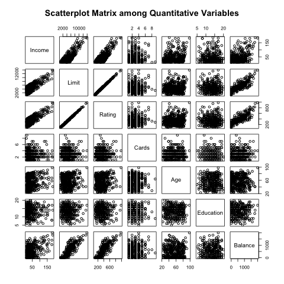
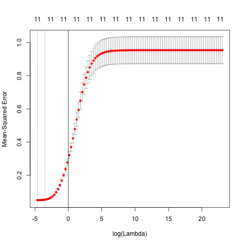
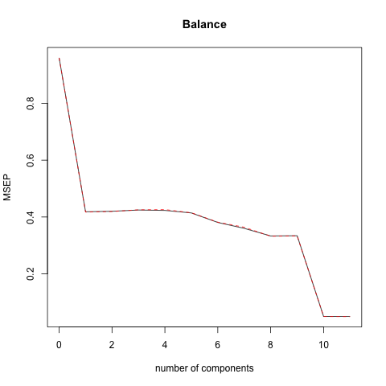
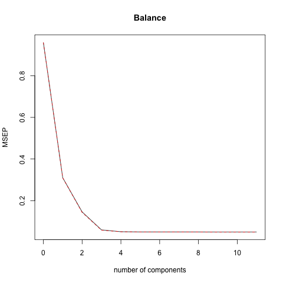

```{r setup 3, include=FALSE}
knitr::opts_chunk$set(echo = FALSE)
knitr::opts_chunk$set(message = FALSE)
knitr::opts_chunk$set(warning = FALSE)
```

```{r, echo=FALSE}
library(knitr)
load('../data/ols_model.RData')
load('../data/ridge_models.RData')
load('../data/lasso_models.RData')
load('../data/pcr_models.RData')
load('../data/plsr_models.RData')
load('../data/correlation_matrix.RData')
```

## Objective

_ This presentation deals with the effectiveness of different regression models when they are applied to a dataset to predict a response

_ Dataset : "Credit" from "An Introduction to Statistical Learning" by James  et all


# Data

## Quantitative Variables

* `Income`: customer's income
* `Limit`: customer's credit limit
* `Rating`: customer's credit rating
* `Cards`: number of credit cards
* `Age`: customer's age
* `Education`: number of years in education
* `Balance`: current balance in the customer's bank

## Qualitative Variables

* `Gender`: customer's gender (factor with two levels - Male/Female)
* `Student`: customer's current student status (factor with 2 levels - Yes/No)
* `Married`: customer's current marital status (factor with 2 levels - Yes/No)
* `Ethnicity`: customer's ethnicity (factor with 3 levels - Asian/Caucasian/AfricanAmerican)

## Association between Balance and the rest of predictors
Scatterplot matrix helps us visualize the relationship between variable `Balance` and the other predictors

```{r, out.width = "200px", echo=FALSE, fig.align="center"}

```

# Methodology

## Methods

_Ordinary Least Squares_

* approach to predict a quantitative response $Y$ based on a multiple predictor variables $X_1$ through $X_p$.

_Shrinkage Methods_

* A general technique to improve a least-squares estimator, which reduces the variance by adding constraints on the value of coefficients.

_Dimension Reduction_

* Regression methods to reduce the dimensionality enough to still explain most of the variance in the response variable Balance

# Analysis

## Ordinary Least Square

Below is the table of coefficients of each predictor when regressed against `Balance`

```{r, echo = FALSE, results = 'asis', message = FALSE}
library(xtable)
ols_coef <- data.frame('Coefficients' = names(ols$coefficients),
                       'Values' = unname(ols$coefficients))
ols_tbl = xtable(ols_coef, 
                         caption = 'Table of coefficients of each predictor when regressed against Balance',
                         digits = 5)
print(ols_tbl, caption.placement = 'top',
      comment = getOption('xtable.comment', FALSE),
      include.rownames = FALSE)
```


## Lasso

LASSO regression fits the model using our training data and cross-validation technique to determine the lambda value that minimizes mean-squared error.

Below is the errors produced by the technique

```{r, out.width = "200px", echo=FALSE, fig.align="center"}
knitr::include_graphics("../images/lasso_cv_errors_plot.png")
```

Lambda value that minimizess mean-squared error is `r best_lambda`

## Ridge Regression

 First we fit the model using out training data and cross-validation technique to determine the lambda value that minimizes mean-squared error: `r ridge_lambda`.

```{r, out.width = "300px", echo=FALSE, fig.align="center"}

```

## Principle Component Regression (PCR)

Solve for the number of components with the smallest Predictive Residual Error Sum of Squares ($PRESS$).

```{r, out.width = "300px", echo=FALSE, fig.align="center"}

```

Number of components that yields the minimum $PRESS$ value is `r pcr_ncomp`.

## PLSR

The partial least squares regression finds the smallest number of components, having a slightly different method that PCR. The minimum of this graph is the optimum number of components.

```{r, out.width = "300px", echo=FALSE, fig.align="center"}

```

## Conclusion

From the results of our analysis, we learned that the Ridge regression method yield the best predictions for Balance based on our observations on MSE value for each regression method. 

To increase the validity of the finding, we should also look at how the estimated beta coefficients generated by this method are fair compared with the ones created by other regression techniques. If we look at the chart from the Results section, we can see that Ridge's beta coefficients are fairly consistent with the ones generated by LASSO, OLS and PLSR. That solidifies our finding that Ridge Regression yield the best predictions.

